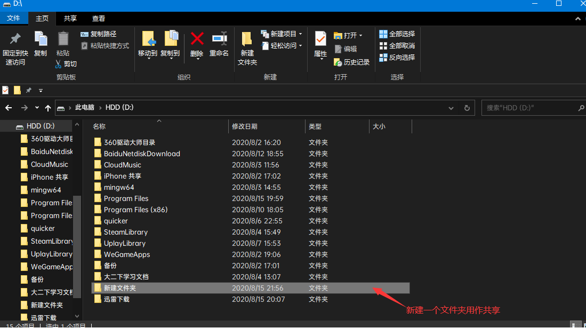
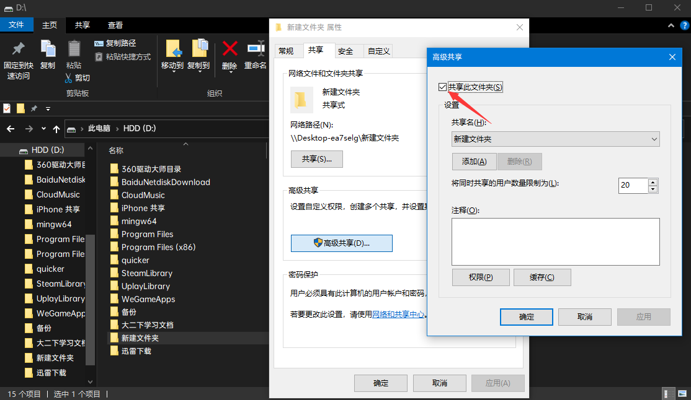
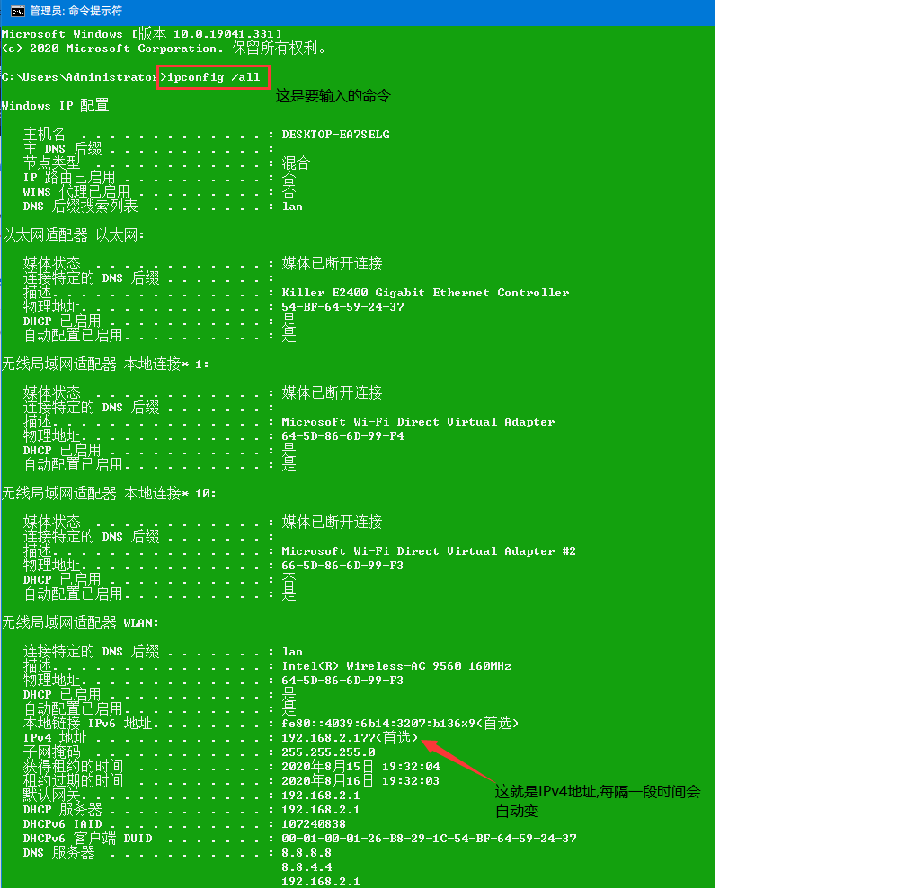

# iPhone-to-Windows
如何在Windows上建立smb共享文件夹并与iPhone共享
## 第一步
### 你需要在Windows上建立你需要共享的文件夹

## 第二步
### 右键创建的文件夹->属性->共享->高级共享->选择共享此文件夹

## 第三步
### 在手机上打开系统自带文件App->点击右上角->连接服务器->输入: smb://(电脑的IPv4地址)->下一步->名称: 电脑的用户名 密码: 电脑开机密码->下一步

## 第四步
### 测试是否设置成功
